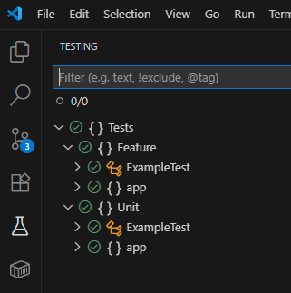
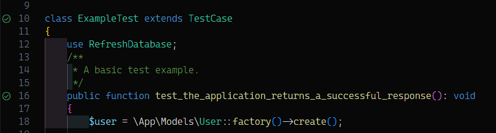

# Control - Tests

## Test Suites

Two test suites have been created:

- **Unit**: Contains stand-alone tests
- **Feature**: Contains tests that require a database connection and proper scaffolding

> **Info:** ℹ️ Most tests in Unit are, strictly speaking, integration tests as they touch the database. We will amend this at a later date.

### Scope

- `\app` Directory

### Methodology

Since this project is live, the general assumption for adding tests is that "Code is good".
It may be missing some additions to properly test certain scenarios (getters, setters, additional methods, etc.)

## Test Environment

Following the Development Setup in [README.md](..\readme.md), create a local environment to execute `docker compose` commands in.

### Example - Windows with VSCode

You can use VsCode and the recommended extensions in this repo to get started. We are using the `PHPunit Test Explorer` with native Test Adapter configuration

## Execution

### Manual

To execute all tests

```powershell
# This takes a few minutes to complete
docker compose run artisan test
```

Run specific Test by name (this may discover multiple tests)

```powershell
docker compose run --rm artisan test --filter GenericTicketProviderTest
# or
docker compose run --rm artisan test --filter="Generic Ticket Provider Test"
```

Run tests for a specific file:

```powershell
# use file path from repo root
docker compose run --rm artisan test tests/Feature/ExampleTest.php
```

Create full Code Coverage run by running:

```powershell
docker compose run --rm -e XDEBUG_MODE=coverage test --configuration=phpunit.xml --coverage-clover=clover.xml --coverage-html=html-coverage
```

Inspect `\html-coverage\index.html` for output, once complete

### VsCode Test Adapter

Install the recommended extensions and add the following configuration in your workspace settings file:

```json
{
    "settings": {
        // Enable running artisan commands in Docker
        "artisan.docker.enabled": true,
        "artisan.docker.command": "docker compose run --rm artisan",
        // PHPUnit Text Explorer (recca0120) - Configuration for CONTROL
        "phpunit.command": "docker compose run --rm",
        "phpunit.phpunit": "artisan test",
        "phpunit.php": "",
        "phpunit.paths": {
            // Translate to your local file path as needed
            "d:\\Code\\Public\\control\\tests": "tests",
            "d:\\Code\\Public\\control\\app": "app"
        },
    }
}
```

Afterwards, they are discovered automatically and can be run either in the Tests hive:




Alternatively, they can be run via the gutter icon (run all tests on `class` or individual test on `function`):



### Inside the container

```powershell
# create a shell
docker compose run --rm --entrypoint sh artisan

# run PHP command inside the shell
php vendor/bin/phpunit
```

## Workflow

### Wave 1 - AUG 2025

- [x] Each file has _at least_ a stub file with the same name + `test.php` in the corresponding Folder Structure (some were missed, mea culpa - David)
- [x] Each file has a few unit tests created
- [x] Database is up-and-running for testing (sqllite)
- [x] All Unit Tests succeed

#### Output / Lessons learnt

- Some TODOs require developer attention to resolve. They have been left in the code base
- Evaluate files with highest CRAP scores and potentially refactor
- More tests are needed to generate a decent coverage
- See [potential refactor proposal](SettingsTestabilityRefactor.md) for better testability

#### Code Coverage

Run the following command manually

```powershell
docker compose run --rm -e XDEBUG_MODE=coverage test --configuration=phpunit.xml --coverage-clover=clover.xml --coverage-html=html-coverage
```

The following output is produced (added to `.gitignore`):

- Files: `clover.xml` and `coverage.txt` for brief overview
- HTML Report; The `html-coverage\index.html` should give a more in-depth analysis

#### Status

All tests succeed and are decently specced.

Mockery was initially used, before switching to Eloquent-backed tooling

Code Coverage: We currently have 50% coverage across the board.

> **Note:** 💡 Currently, we have tests that live mostly in Unit but are Feature/Integration tests, this will be addressed later, when expanding upon it more.

### Wave 2 - SEP 2025 (planned)

- [ ] Create test files for each file - no file should have 0% coverage
- [ ] Separating Test scopes properly
- [ ] Increase coverage distribution to at least 50%
  - [ ] `http`
    - [ ] `Controllers`
      - [ ] Admin
        - [ ] `ClanController`
        - [ ] `EmailAddressController`
        - [ ] `EventMappingController`
        - [ ] `EventTicketProviderController` (new)
        - [ ] Add missing Controller files
      - [ ] `ClanController`
      - [ ] `UserController`
    - [ ] `Requests`
      - [ ] `TicketTransferRequest`
    - [ ] `Middleware`
      - [ ] `RedirectIfAuthenticated` (new)
  - [ ] `Models`
    - [ ] `Event`
    - [ ] `Role`
    - [ ] `Seat`
    - [ ] `SeatGroup`
    - [ ] `SeatingPlan`
    - [ ] `Ticket`
    - [ ] `TicketProvider`
    - [ ] `User`
  - [ ] `Observers`
    - [ ] `SeatObserver`
    - [ ] `SettingObserver`
    - [ ] `ThemeObserver`
    - [ ] `TicketProviderObserver`
  - [ ] `Policies`
    - [ ] `ClanPolicy`
  - [ ] `Services`
    - [ ] `TicketProviders`
      - [ ] `FakeProvider`
      - [ ] `GenericTicketProvider`
      - [ ] `TicketTailorProvider`
      - [ ] `WooCommerceProvider`
- [ ] Increase coverage for Lines to 75%
- [ ] Increase coverage for Functions and Methods to 75%
- [ ] Increase coverage for Classes and Traits to 75%
- [ ] Define proper exclusions - Elements not tested:
  - [ ] Lavarel default code (if not adapted)
  - [ ] OpenTelemetry - Standard library
  - [ ] ...
- [ ] Replace Mockery with Eloquent-backed methods across the board
- [ ] Add GitHub Action to run Unit Tests on PR
- [ ] Add GitHub Action to run Code Coverage validation on Dispatch
