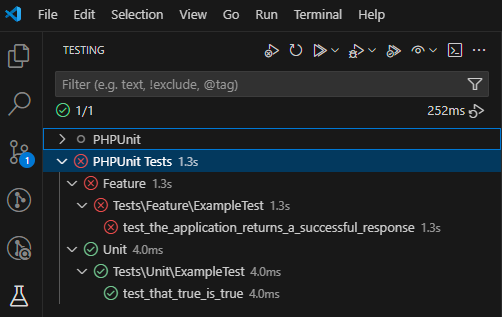

# Test Setup

This is DE/WIP

Setting up tests manually

```bash
cp .env.example .env
docker compose up -d redis db
docker compose run --rm composer install
docker compose run --rm artisan key:generate
docker compose run --rm artisan migrate
docker compose run --rm artisan db:seed
```

## Run Tests manually

```bash
docker compose run --rm artisan test
```

## Run Tests with Container Shell

```bash
docker compose run --rm --entrypoint sh artisan
```

then run `php vendor/bin/phpunit` or a custom command for specific files as needed.

WIP: Currently Unknown and/or untested:

- How to run individual files? `phpunit tests/Unit/ExampleTest.php`?
- How to run with filters? `phpunit --filter test_that_true_is_true tests/Unit/ExampleTest.php`?

## VsCode Custom Task

Task "Run Laravel Tests in Docker" created in `.vscode\tasks.json`, this allows you to run unit tests directly with CTRL+SHIFT+P > Run Tasks > Run Laravel Tests in Docker

Requires the docker container to be up and running

## Run PHPunit tests in VsCode Test Adapter

Add the following line in your workspace settings.json

```json
"phpunit.execPath": "docker compose run --rm --entrypoint php control vendor/bin/phpunit"
```

This will allow PHPunit tests to be run directly in VScode and support ongoing development while testing:


NOTE: The first entry point "PHPUnit" did not successfully run with this configuration. YAGNI?


## TODO

- [ ] Create custom script/shortcut to test individual files by hand?
- [ ] Remove non-workable `PHPunit` hive in Test adapter? Different extension?
- [ ] Create Github action to run PHPunit tests with a build in GitHub (hook on commit/PR?)
- [ ] Define scope for unit tests


### Unit Test Scope

